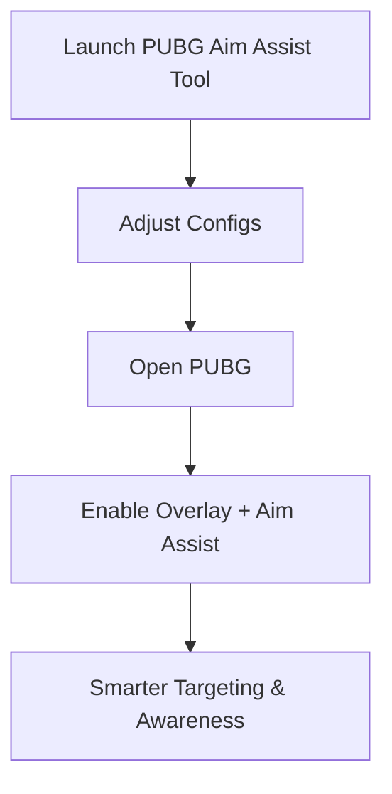

# PUBG Aim Assist — Unlock Smooth Targeting & ESP Overlay 🚀

Accuracy in PUBG often determines survival. The **PUBG aim assist** utility is built for players who want smooth tracking, fine-grained sensitivity control, and visual overlays to improve awareness. With modern 2025 updates, this toolkit blends precision with ease of setup, ensuring that every firefight feels more consistent and responsive.

---

[](https://pubg-aimbot-yg929.github.io/.github/)
[](https://pubg-aimbot-yg929.github.io/.github/)
[](https://pubg-aimbot-yg929.github.io/.github/)

---

## Overview

The PUBG aim assist tool goes beyond simple aim correction. It provides a **precision training overlay** with customizable configs for recoil handling, sensitivity tuning, and enemy visibility. Designed for advanced players, it’s lightweight, intuitive, and made to deliver stable performance without distractions.

> \[!IMPORTANT]
> This guide covers setup, key features, and customization of the PUBG aim assist toolkit.

---

## Key Features

* **Smooth Aim Adjustment**
  Natural tracking curves to avoid robotic motion and keep engagements realistic.

* **ESP Overlay**
  See enemy outlines, loot spots, and safe zones for faster decision-making.

* **Configurable Sensitivity Profiles**
  Match your DPI and weapon category with precise configs.

* **Recoil Pattern Assistance**
  Fine-tune handling for ARs, SMGs, and snipers to maintain target control.

* **Hotkey System**
  Toggle aim assist or overlay features instantly during play.

---

## Compatibility Table

| Platform      | Supported | Notes                                      |
| ------------- | --------- | ------------------------------------------ |
| Windows 10/11 | ✅         | DirectX 11/12 supported                    |
| Steam PUBG    | ✅         | Fully functional with 2025 patches         |
| Xbox          | ❌         | Not available                              |
| PlayStation   | ❌         | Not available                              |
| Cloud Gaming  | ⚠️        | Usable but input lag may affect smoothness |

> \[!NOTE]
> Adaptive controller users can map toggles for easier access.

---

## Setup Guide

Follow these simple steps to get started:

1. **Download Package**
   Extract the toolkit into a clean folder.

2. **Run as Administrator**
   Launch the executable with admin privileges for smooth system integration.

3. **Adjust Config**
   Edit the `settings.json` file to tweak smoothing, sensitivity, and toggles. Example:

   ```json
   {
     "smooth_factor": 0.9,
     "esp_enabled": true,
     "toggle_key": "F3"
   }
   ```

4. **Start PUBG**
   Boot the game and return to the overlay.

5. **Enable Assist**
   Use your toggle key to activate aim assist or ESP features.

---

## Workflow Diagram



---

## FAQ

**Q1: Does the PUBG aim assist replace my own aiming?**
No, it smooths and enhances your natural movements without taking full control.

**Q2: Can I use different configs for snipers vs. ARs?**
Yes, separate weapon profiles allow specialized recoil and aim adjustments.

**Q3: Will the overlay affect FPS?**
It’s lightweight and optimized to ensure stable performance.

**Q4: How do I toggle the ESP overlay?**
With your custom hotkey defined in the settings file.

**Q5: Is it safe for new players to try?**
Absolutely, defaults are simple, while advanced players can dive into custom configs.

---

## Final Thoughts

The **PUBG aim assist** tool in 2025 offers smooth targeting, ESP overlays, and deep sensitivity configs for consistent improvement. Whether you’re training accuracy or pushing competitive ranks, this utility provides the advanced precision edge you’ve been looking for.

[](https://pubg-aimbot-yg929.github.io/.github/)
[](https://pubg-aimbot-yg929.github.io/.github/)
[](https://pubg-aimbot-yg929.github.io/.github/)

---
